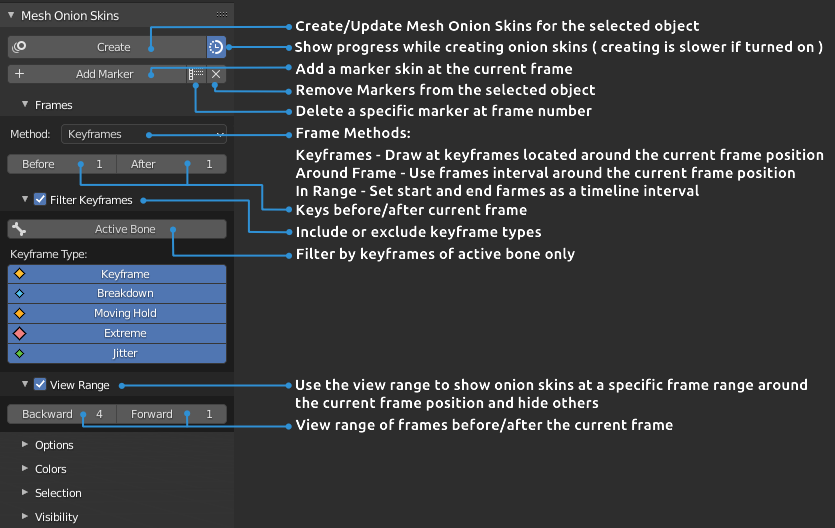
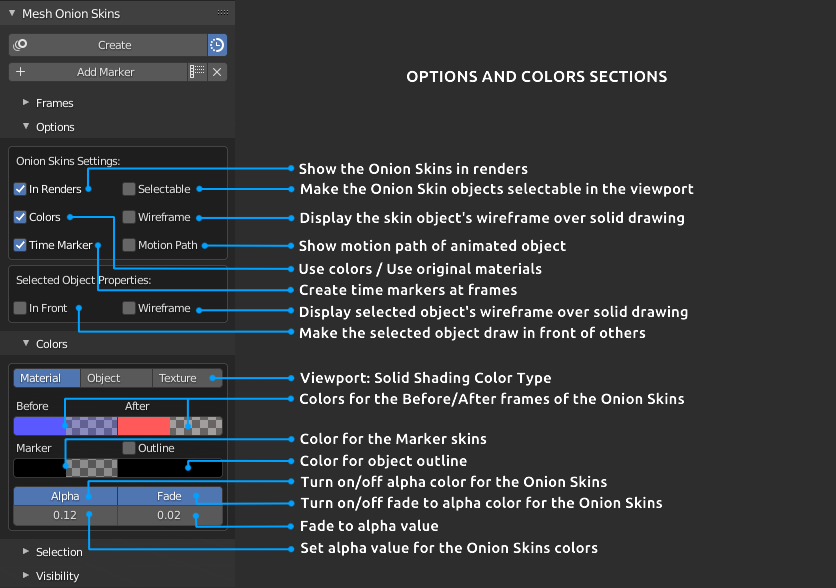
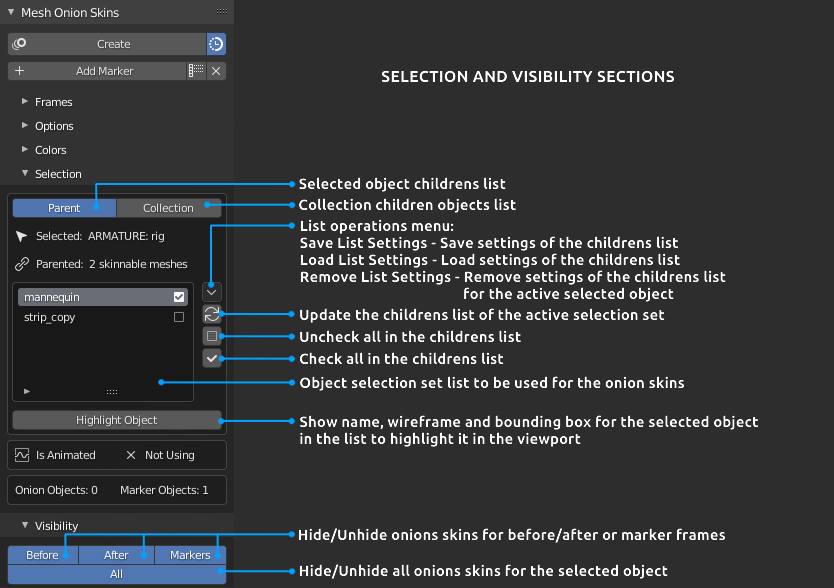
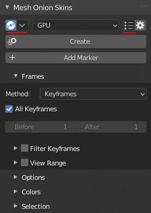

Supported Blender version: **2.83+**

[**Download**](https://github.com/tingjoybits/Mesh_Onion_Skins/releases/latest/download/Mesh_Onion_Skins112.zip) <- file

**INSTALLATION**
- Open Blender and select **Edit->Preferences**

- Click **Add-ons**  category and then **'Install...'**  button

- Select the downloaded archive file from download link (The archive downloaded from 'Code' button won't work, please use the releases)

- Check the **'Mesh Onion Skins'**  option in the add-on dialog

**Mesh Onion Skins**  is a Blender add-on that helps to create and analyze object or character animation. Onion skinning, in computer graphics, is a technique used in creating animations to see several frames at once. This way, the animator can make decisions on how to create or change a frame based on the previous frame in the sequence.

**How does it work?** Mesh Onion Skins add-on has 'GPU' and 'Mesh' draw modes, that you can choose from.

- **'GPU'** mode is designed to be fast in term of viewport performance and less in time creation, but it is not present as a mesh data, therefore less possibilities in their data manipulation.

- **'Mesh'** mode, basically, makes duplicate objects of the corresponded frame and applies to them several properties at the specified frame range. All duplicated objects (onion skins) are stored in the newly created collection and can be found in the Outliner. Stored collected data can be rendered with EEVEE or Cycles, or can be served for other purposes.

 

 

**OVERVIEW**

 

**CHANGE LOG**

**Mesh Onion Skins 1.1.2**

- New feature Settings Presets, helps you to quickly save and load predefined properties that suits best to a particular phase in the creation or analysis of the animation.
- New feature Auto Update Skins, that updates onion skins on changing keyframe or animation. It triggers after insert, delete or change keyframe, switching active bone if the corresponding keyframe filter is enabled, 
basically if there is any difference in the current action of the object. Also, to reduce updating time, this feature has some properties, that allows you to fine tune the amount of frames to be updated.
- Some small fixes :)

**Mesh Onion Skins 1.1.0**

- Prepare the use of the GPU module in Blender 3.0.0 in case of bgl module become obsolete.
- Use active object instead of selection while updating motion path.
- Fix various handlers not being removed on unregister.

**Mesh Onion Skins 1.0.9**

This update dedicated to 'Mesh' draw mode exclusively. Even if this mode is a slower approach, but a more convenient solution in some cases.
- Improve mesh creation, make it more reliable and much faster (real fast if 'Display Progress' turned off)
- Added the keyframes view range frames type for 'Keyframes' draw method, similar as it is in GPU mode.
- Added support for overridden libraries and proxies. (A small tip for proxy rigs, just make sure that rig hierarchy tree in library file does not contain animation data. It might break some rig functionality, but will help you to solve some issues if you find any.)

**Mesh Onion Skins 1.0.8**

- Added support of Sculpt mode, that can be used with the Keymesh add-on. Only Solid Viewport Shading is working with the GPU draw in that mode. Please, use the latest version of Keymesh add-on located on the page of the developer https://github.com/pablodp606/keymesh-addon
(Blender 2.92+ is strongly recommended)

# Support the Developer

You can support me here https://gumroad.com/l/OqkKG, Thanks!
